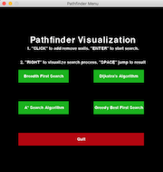
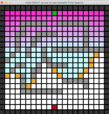

# Pathfinding Algorithm Implementation 

This pathfinding visualization project demonstrates the difference between four popular graph searching algorithms. They all utilized concepts of graph theory to and although the visualization may seem simply, the algorithms driving the code are relevant to biomedical networks, automation, data mining, and many more processes. 

Requirements to run game package (refer to Pipfile):
- Python 3.6.x
- numpy 
- pygame

If you are unsure whether your current enviornment configuration satisfies the project's dependencies, you can install the package(s) and/or version(s) required to run with the following steps.
- Clone the GitHub repository
- Download Pipenv on your system -> pip install pipenv
- Type the following at command line -> pipenv install
- This will automatically use the Pipfiles to create a virtual enviornment on your system that satisfies the required dependencies. 

*1) Main Menu*: Pick which algorithm you would like to run by clicking the button.

*2) Build Maze*: Click mouse and/or hold down mouse over the grid to add or remove walls. Press "ENTER" once finished.

*3) Start Search*: Click or hold down "RIGHT" arrow key to visualize the search method. Alternatively, you can press "SPACE" to jump to the end search results.

*4) Try Search Again*: Click on grid again to modify the maze walls or press "M" key to return to menu and pick new search algorithm.
