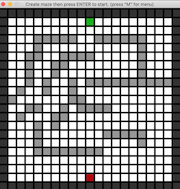
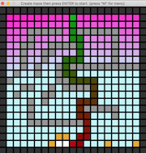

# Pathfinding Algorithm Implementation 

This pathfinding visualization project demonstrates the difference between four popular graph searching algorithms. They all utilized concepts of graph theory to and although the visualization may seem simply, the algorithms driving the code are relevant to biomedical networks, automation, data mining, and many more processes. 

For proper execution of the code, look at the followng files:
- Pipfile shows the 3rd-party packages used and required to run the project. 
- requirements.txt shows the names and versions of all the build-in and 3rd party packages used to develop the project.

To run the code:
- Ensure python version 3.6 is running (required for pygame version)
- Check if all 3rd-party packages are present
- Clone the repository
- Run the game.py file 

*1) Main Menu*: Pick which algorithm you would like to run by clicking the button.

*2) Build Maze*: Click mouse and/or hold down mouse over the grid to add or remove walls. Press "ENTER" once finished.

*3) Start Search*: Click or hold down "RIGHT" arrow key to visualize the search method. Alternatively, you can press "SPACE" to jump to the end search results.

*4) Try Search Again*: Click on grid again to modify the maze walls or press "M" key to return to menu and pick new search algorithm.
